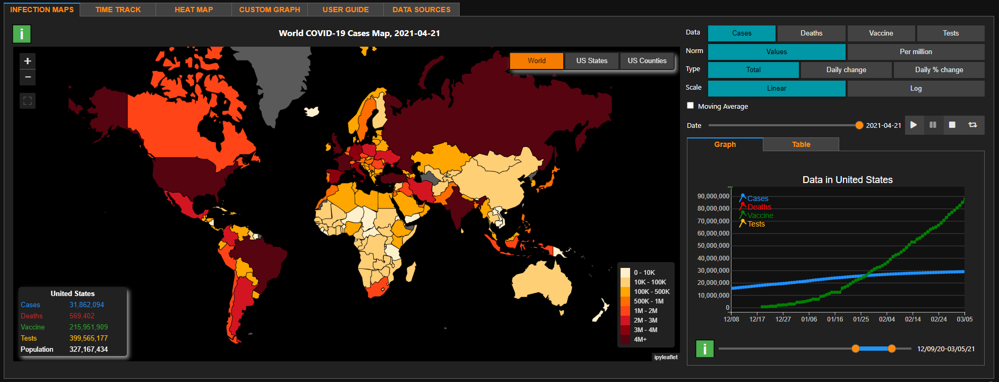
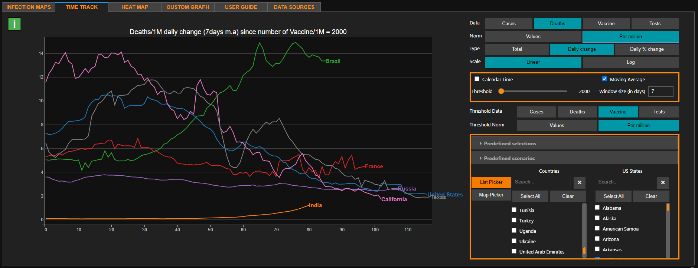
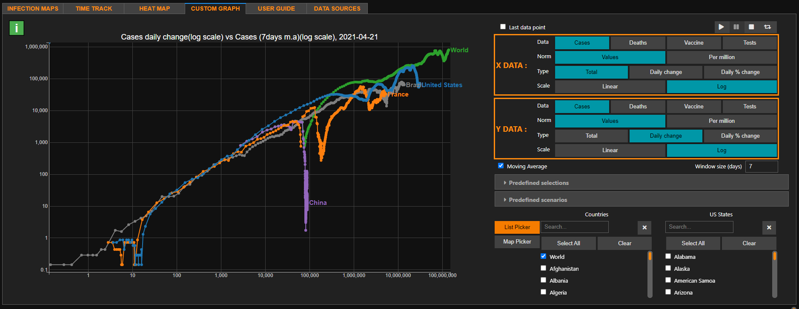
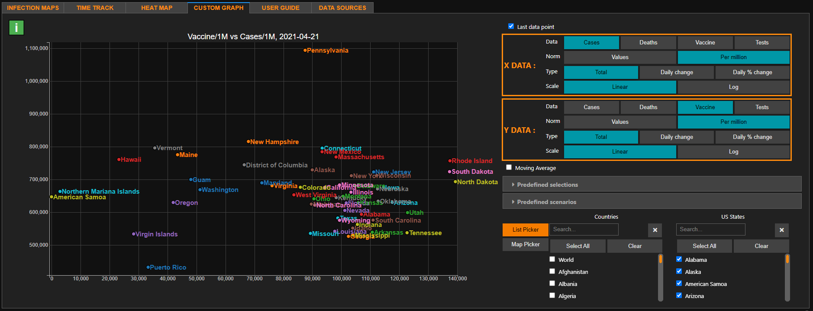

# Bloomberg Quant Research: COVID-19 Dashboard (BCD)

Jupyter notebooks for COVID-19 data analysis & visualization

## Getting started

### Mac

The one-time setup and launch of the BCD application will take about 5 minutes. After that, you’ll be able to launch it in less than a minute each time.

Please note that any text you need to copy/paste be offset by quotes (“”). Do not include the quotes when you copy/paste from the instructions below.

#### First time setup

- Follow the instructions to download Docker here: https://docs.docker.com/get-docker/
- Click this link to download a folder that contains the source code for BCD: https://github.com/bloomberg/quant-research/archive/master.zip
- After you download it, double-click the folder called quant-research master. You should now see a folder called covid. Take note of where this folder is saved on your computer because you will need to access it later.
- Find your computer’s Terminal and click to open it. On a Mac, this is typically in Applications > Utilities > Terminal.
- Once the Terminal window opens, type “cd “ (please note that you have to copy the letters cd and the space after the d), then find the folder called covid that you just downloaded – do not hit enter just yet!
- Drag the covid folder into the Terminal window just after the space in “cd “ and now you can hit enter.
- You’ll see the Terminal auto-run some commands. When it finishes, copy this text, paste it into the Terminal window, and then hit enter: “docker build -t bloomberg-covid-dashboard .” (please note the . is inside the quotes and has a space in front of it – you need to copy/paste both)
- You’ll once again see the Terminal auto-run some commands while it is building the application. This will take a little over a minute to complete.
- Copy this text and paste it into the Terminal window, then hit enter: “docker run -p 8866:8866 bloomberg-covid-dashboard”
- Click this link to launch BCD: http://localhost:8866
- You’ll see a black screen and in about 30 seconds, the BCD application will open – you are finished!

#### Returning users

- Find your computer’s Terminal and click to open it. On a Mac, this is typically in Applications > Utilities > Terminal.
- Copy this text and paste it into the Terminal window, then hit enter: “docker run -p 8866:8866 bloomberg-covid-dashboard”
- Click this link to launch BCD: http://localhost:8866

### Windows

The one-time setup and launch of the BCD application will take about 15 minutes. After that, you’ll be able to launch it in less than a minute each time.

Please note that any text you need to copy/paste be offset by quotes (“”). Do not include the quotes when you copy/paste from the instructions below.

#### First time setup

- Follow the instructions to download Docker here (note that you may be asked to install WSL components for Windows and restart Windows): https://docs.docker.com/get-docker/
  - In addition, if you are running Windows 10 Home or you are not an admin on Windows 10 Professional, you will need to follow additional steps that you can find detailed in the section titled “Install Docker Desktop on Windows”; you will need to reboot your computer to complete the setup. If you are not sure which version of the operating system you have or whether you are an admin, follow the additional steps.
- Click this link to download a folder that contains the source code for BCD: https://github.com/bloomberg/quant-research/archive/master.zip
- After you download it, unzip/open the folder called quant-research master. To do this, right click on the folder name and click extract. Then, click into the unzipped quant-research master folder. You should now see a folder called covid. Take note of where this folder is saved on your computer because you will need to access it later.
- Find your computer’s Terminal and click to open it. On a Windows machine, you can typically type “PowerShell” in the Windows search bar.
- Once the Terminal window opens, if you see a directory for anything other than C:, type “C:” and then enter
- Type “cd “ (please note that you have to copy the letters cd and the space after the d), then find the folder called covid that you just downloaded. Do not hit enter after you type “cd “.
- Click into the covid folder and copy the path to that folder.
- Paste the folder path after the space in “cd “ and hit enter.
- You’ll see the Terminal auto-run some commands. When it finishes, copy this text and paste it into the Terminal window, then hit enter: “docker build -t bloomberg-covid-dashboard .” (please note the . is inside the quotes and has a space in front of it – you need to copy/paste both)
- You’ll once again see the Terminal auto-run some commands while it is building the application. This will take a little over a minute to complete.
- Copy this text and paste it into the Terminal window, then hit enter: “docker run -p 8866:8866 bloomberg-covid-dashboard”
- Click this link to launch BCD and you are finished: http://localhost:8866
- You’ll see a black screen and in about 30 seconds, the BCD application will open!

#### Returning users

- Find your computer’s Terminal and click to open it. On a Windows machine, you can typically type “PowerShell” in the Windows search bar.
- Once the Terminal window opens, if you see a directory for anything other than C:, type “C:” and then enter.
  - Copy this text and paste it into the Terminal window, then hit enter: “docker run -p 8866:8866 bloomberg-covid-dashboard”
  - Click this link to launch BCD: http://localhost:8866

## Data Source

The data repository for Novel Coronavirus (COVID-19) Cases is provided by Johns Hopkins University Center for Systems Science and Engineering (JHU CSSE), which curates the datasets from various sources including WHO, CDC and others.

https://github.com/CSSEGISandData/COVID-19

## Using the Bloomberg COVID-19 Dashboard

The Dashboard allows users to select a country from an interactive world map and view various statistics. The first tab (Infection Maps) is divided into two panels. The left one presents a map of the world and a map of the United States. The right panel presents a graph of Cases, Deaths, Vaccines, and Tests for the selected country/state and two tables of top 20 countries and states in the chosen category (top left toggle buttons).

There are four groups of toggle buttons in the top left panel:

- Data : Choose which data to use to color the map (Cases, Deaths, Vaccines or Tests)
- Normalization : Use raw values or divide by population
- Type : Total (or cumulative numbers), Diff (or daily differences), % change.
- Scale : Log or Linear
  Changing your selection will update the map's colors, right graph, and the tables.

Map interactions :

- Hover on a country or state to view its statistics.
- Click on a country or state to plot its data in the right figure.

Date selector and animation:

- Select the date of the data to represent.
- Play button to animate maps and tables.

The second tab presents an interactive rebased graph.
Rebased graph example : Log Cases/1MPop in France, Spain and New York since number of deaths = 1000
You can select :

- Output Data :
  - Data to plot (Cases, Deaths, Vaccines or Tests). Cases in our example.
  - Normalization to apply (by population or none). Per 1M Pop in our example
  - Type of time series (Total (cumulative number), Diff (daily differences) or % change). Total in our example.
  - Scale of the rebased graph (Linear or Log). Log in our example.
  - Countries or states. France Spain and New York in our example.
- Threshold Data :
  - Value of the threshold (if equal 0 it will plot data vs calendar days). 1000 in our example.
  - Data to apply threshold on (Cases, Deaths or Vaccines). Deaths in our example.
  - Normalization to apply (by population or raw values). Values in our example.

The third tab shows an interactive heatmap.
Like for the previous tab, you can select the countries/states and the data you want to plot.

The last tab allows you to create your own graph. You can select the data you want to represent on X and Y axes (by clicking on the toggle buttons) and you can select any country or U.S. states. You also have the possibility of representing the whole time series (Line plot) that you can animate or only the last data point (Scatter plot).

## License

This software is licensed under the Apache 2.0 license. See the [LICENSE](LICENSE) file for details.
